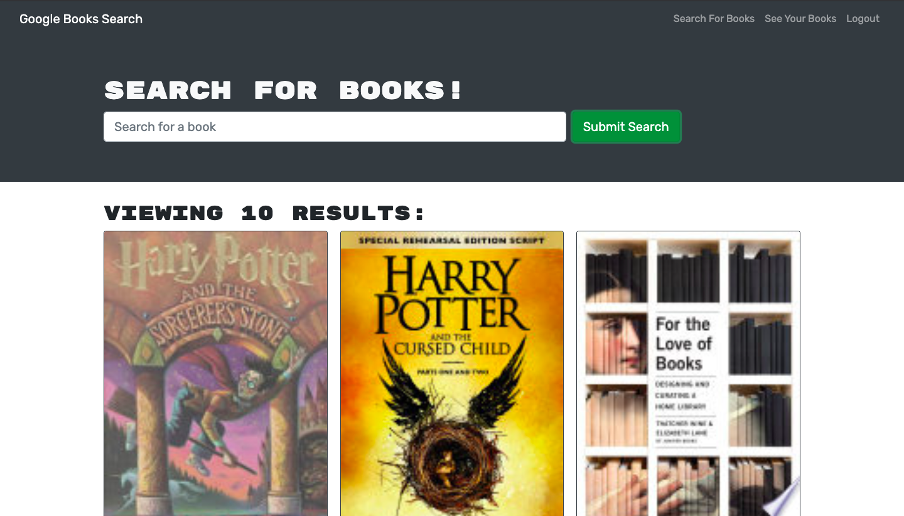

# Book-Search

## Description
This is a MERN stack application that uses the google books api. It allows users to add or delete books from a personal list. 

## Table of Contents
- [Usage](https://github.com/matty-bennett/book-search#usage)
- [Technology](https://github.com/matty-bennett/book-search#technology)
- [Screenshot](https://github.com/matty-bennett/book-search#screenshot)
- [Questions](https://github.com/matty-bennett/book-search#questions)

### Usage
Check out the deployed website [here](https://still-everglades-81622.herokuapp.com/)

### Technology
- React
- GraphQl
- Apollo

### Screenshot

### Questions
Contact me with any questions
 
[GitHub](https://github.com/matty-bennett) [Email](mailto:bennyot10@gmail.com)
